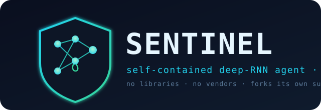

<p align="center">
  
</p>

<p align="center">
  <a href="LICENSE"></a>
  
  <a href="CHANGELOG.md"></a>
  
  
  
</p>

<h1 align="center">Sentinel — your security analyst that never leaves the box</h1>

<p align="center"><sub>by <b>Pr0xy_22</b></sub></p>

**A self-contained AI security agent in one C file. No cloud. No API keys. No vendor.
No per-token bill.** It runs on a $50 Raspberry Pi, answers CVE / malware / OSINT
questions from real data, and spawns its own sub-agents to do the work — entirely on
your machine.

```sh
git clone https://github.com/Mattmorris-dev/Sentinel-SLM && cd Sentinel-SLM
make && ./start.sh
```

> Built for the people cloud AI shuts out: **air-gapped networks, incident responders,
> privacy-first teams, home labs, classrooms.** You compile one file and own the binary
> forever. (See [`PITCH.md`](PITCH.md) for the short version.)

## Contents

- [What it does](#what-it-does)
- [Pick a size](#pick-a-size)
- [See it run](#see-it-run)
- [Build](#build)
- [Run](#run)
- [Training data](#training-data)
- [Shrink it to ship it — quantization](#shrink-it-to-ship-it--quantization)
- [Training quality options](#training-quality-options)
- [Optional online advisor (opt-in)](#optional-online-advisor-opt-in)
- [Architecture](#architecture)
- [Safety](#safety)
- [Free vs Pro](#free-vs-pro)
- [License](#license)

## What it does

- 🛡️ **Answers security questions from real data.** Ask `show me a cve about log4j` or
  `malware like emotet` and it greps a local corpus of **150k+ CVE writeups,
  malware-analysis notes, and OSINT resources** — with optional **live internet** lookup
  for fresh CVEs (`SLM_ONLINE=1`). Knowledge lives in the corpus (retrieval / RAG), which
  is how the model stays small.
- 🤖 **Spawns its own sub-agents.** `TASK:` forks a specialist worker
  (cybersecurity / coding / general); `FANOUT: 100` runs up to a hundred at once, each
  sized to the task's difficulty.
- 🧠 **A real neural net, by hand.** A stacked **GRU** with backprop-through-time and
  **Adam** — no libraries, just libc + libm — that keeps learning from what it reads.
  Optional LayerNorm and weight tying, all verified by a built-in gradient checker.
- 📦 **Ships small.** Export an `int8` (~8× smaller) or quantization-aware-trained
  `1-bit` model for a Pi, a USB stick, or an ESP32.
- 🔒 **Safe by default.** Every command is screened (no `sudo`, no destructive ops); the
  web UI binds to localhost only; `SLM_NO_EXEC=1` makes it plan-only.
- 🖥️ **However you like it.** Web GUI (`--serve`), terminal UI (`--tui`), plain CLI, or a
  single sub-agent call.

## Pick a size

| Build | Params | RAM (training) | Extra flag | Hardware |
|---|---|---|---|---|
| `make pet-model` | ~0.2M | a few MB | — | ESP32 (exported as 1-bit, ~38 KB) |
| `make slm` | ~0.8M | ~27 MB | — | a potato |
| `make` (default) | ~58M | ~1.9 GB | — (plain gcc) | a Pi 4 / any laptop |
| `make huge` | ~143M | ~4.6 GB | `-mcmodel=large` | **8 GB Pi 5** (flagship) / a server |

One source, dimension-generic: pick the biggest that fits your RAM. Training is
CPU-bound and slow at the top end (hours), so train on a fast box and ship a quantized
export to the Pi for fast, low-RAM inference. Long runs auto-save a checkpoint every
2000 iterations, so an interrupted train resumes instead of starting over.

It's a genuine deep network with real weights, gradients, and GRU backprop, built by
hand in standard C. It learns character/word statistics (not fluent prose); the power is
the **complete, dependency-free, fully local pipeline**: tokenizer → embedding → stacked
GRU → BPTT/Adam → checkpointing → retrieval → process-spawning agents.

## See it run

```sh
./demo.sh    # builds the tiny SLM, grabs a small corpus, runs a scripted showcase
```

Real output (a CVE lookup, a coding agent that *compiles and runs C*, and a fan-out of
concurrent workers — all local):

```text
[trigger detected] spawning sub-agent (tier=medium) for: "show me a cve about http"
  ┌─ sub-agent pid=2112  specialism=CYBERSECURITY  tier=medium (param-budget≈512K, 8s cap)
  │  [retrieval agent] topic=cve  searching corpus for: http
  │  === corpus/cve_famous/CVE-2023-44487.md ===
  │  ### [CVE-2023-44487]
  │  ### Description
  │  The HTTP/2 protocol allows a denial of service (server resource consumption) because
  │  request cancellation can reset many streams quickly, as exploited in the wild ...
  └─ sub-agent pid=2112 finished (exit 0)

[trigger detected] spawning sub-agent (tier=heavy) for: "write a C function to reverse a string"
  ┌─ sub-agent pid=2630  specialism=CODING  tier=heavy (param-budget≈4096K, 20s cap)
  │  [coding agent] compiled OK, running:
  │  reversed: ytirucesrebyc
  └─ sub-agent pid=2630 finished (exit 0)

[fan-out] launching 12 concurrent sub-agents (tier=light) for: "report current date"
  · agent pid=2647 tier=light ... (exit 0)        ·  (×12, all concurrent)
[fan-out] 12 sub-agents completed.
```

### Interfaces

| Terminal UI (`./sentinel --tui`) | Web GUI (`./sentinel --serve 8080`) |
|:---:|:---:|
|  |  |

- **`--tui`** — a colored, framed terminal console for typing tasks, `FANOUT:` batches,
  and CVE questions interactively.
- **`--serve [port]`** — a tiny built-in HTTP server (pure C sockets) serving a chat-style
  page. It **binds to 127.0.0.1 only**, because agents run real shell commands — don't
  expose it to a network.

<sub>Mockups shown; run `./sentinel --tui` / `./sentinel --serve 8080` for the real thing.</sub>

## Build

No dependencies beyond a C compiler and libm:

```sh
gcc -O2 -Wall -o sentinel main.c -lm
```

Or use the Makefile (`make help` lists everything):

| Target | What it does |
|---|---|
| `make` | build the default ~58M model (`./sentinel`) |
| `make slm` | build the small SLM (`./sentinel-slm`) |
| `make huge` | build the 8 GB Pi 5 flagship (`./sentinel-huge`) |
| `make ln` | build with LayerNorm (`./sentinel-ln`) — see [Training quality](#training-quality-options) |
| `make quant` | export `int8` + `1-bit` copies of your trained model |
| `make pet-model` | train the tiny on-device model with 1-bit QAT and emit `model.h` |
| `make gradcheck` | numerically verify the backprop (tiny build + `--gradcheck`) |
| `make quick-fetch && make train` | fetch a demo corpus and train on it |
| `make run` | train on the built-in corpus, then serve the agent loop |
| `make install` | install to `/usr/local/bin` (`PREFIX` overridable) |
| `make package` | build a source release tarball |

## Run

```sh
# Train on the built-in corpus, print the loss curve + a sample, then serve.
# Plain text on stdin -> online learning. Lines with "TASK:" -> spawn a sub-agent.
printf 'TASK: list files in this directory\nTASK: write a C function to reverse a string\n' | ./sentinel
```

| Command | What it does |
|---|---|
| `./sentinel --agent "<task>"` | run once as a single sub-agent |
| `./sentinel --train <path...>` | consolidate files/dirs into a corpus and train on it |
| `./sentinel --tui` | terminal UI |
| `./sentinel --serve [port]` | web GUI on `127.0.0.1` (localhost only) |
| `./sentinel --quantize <int8\|1bit>` | export a small quantized copy (float checkpoint untouched) |
| `./sentinel --sample-quant <file>` | sample from a quantized model |
| `./sentinel --quantize-train <int8\|1bit>` | quantization-aware training |
| `./sentinel --gradcheck` | verify gradients against finite differences |
| `./sentinel --ask-opus "<q>"` / `--self-study [n]` | opt-in online advisor |

**In the interactive loop:** `TASK: <x>` spawns one agent; `FANOUT: <n> <x>` spawns up to
100 concurrently; a plain `cve` / `vuln` / `malware` / `osint` question triggers
retrieval; any other text is absorbed as live training data. Ctrl-D quits and
checkpoints.

**Environment variables**

| Variable | Effect |
|---|---|
| `SLM_EPOCHS=N` | training iterations (default 2000) |
| `SLM_LR=F` | override the base learning rate (default 0.002) |
| `SLM_NO_EXEC=1` | agents plan only — print commands, run nothing |
| `SLM_ONLINE=1` | allow live CVE lookup over the internet |
| `ANTHROPIC_API_KEY` | enables the opt-in advisor; unset = fully local |
| `SENTINEL_OPUS_MODEL` | advisor model id (default `claude-opus-5-5`) |

### Difficulty-tiered sub-agents

Each task is auto-assigned a tier — `light` / `medium` / `heavy` — from its length and
keywords, which sets its compute budget and time cap. Sub-agents are cheap: re-exec'ing
into `--agent` mode never touches the big weight arrays, so 100 of them use a few
hundred MB total, not 100 × 1 GB.

```text
TASK: list files in this directory          # one agent, tier auto-detected
FANOUT: 100 scan local network ports        # 100 concurrent agents
```

## Training data

`--train` accepts any mix of files and directories. Directories are walked recursively
and every text/code file (`.txt .md .c .h .py .js .json .csv .html .java .rs .go .sh …`)
is folded into **one** corpus before training (dotfiles and `.git` skipped; capped at
64 MB).

```sh
SLM_EPOCHS=20000 ./sentinel --train ./my_notes ./some_repo/src
```

To train on real security + coding knowledge, `fetch_corpus.sh` clones a curated set of
**free, open-source** repositories plus public CVE writeups into `./corpus`. Only `git` +
`curl`, no API keys, and training runs fully offline afterwards.

```sh
QUICK=1 ./fetch_corpus.sh        # small/fast demo: famous CVEs + a couple repos
./fetch_corpus.sh                # full corpus
CVE_YEARS="2022 2023 2024 2025" ./fetch_corpus.sh
./sentinel --train corpus
```

Sources (editable arrays at the top of the script): **security** — OWASP Cheat Sheets,
PayloadsAllTheThings, the-book-of-secret-knowledge; **coding** — TheAlgorithms;
**neural-net reference** — micrograd, char-rnn, nanoGPT; **CVE data** — `trickest/cve`
(150k+ writeups, pulled per-year via sparse checkout).

## Shrink it to ship it — quantization

The trained weights are 8-byte doubles — heavy to copy onto a Pi, a USB stick, or a
microcontroller. Sentinel exports a compact **quantized** copy without touching your
float checkpoint:

```sh
make quant                                        # writes sentinel-int8.bin + sentinel-1bit.bin
./sentinel --quantize int8                        # per-row scale, ~8x smaller than the weights
./sentinel --quantize 1bit                        # sign + per-row magnitude (BinaryConnect style)
./sentinel --sample-quant sentinel-int8.bin 200   # check the small model still generates
```

| Format | Bytes/param | vs. float weights | Quality |
|---|---|---|---|
| `int8` | ~1.0 | ~8× smaller | essentially lossless — **recommended** |
| `1bit` (plain) | ~0.13 | ~64× smaller | unusable without QAT |
| `1bit` (QAT) | ~0.13 | ~64× smaller | coherent — see below |

Plain quantization makes the file **smaller**, not the model **smarter**, and converting a
1-bit model back to doubles does **not** recover quality — that information is gone.

### Quantization-aware training (a *good* low-bit model)

Train *with* the quantization in the loop: `--quantize-train` runs the forward/backward
pass on fake-quantized weights while Adam updates full-precision latent weights
(straight-through estimator). In testing this turned 1-bit output from gibberish into
coherent text across every model size tried.

```sh
SLM_EPOCHS=20000 ./sentinel --quantize-train 1bit corpus
SLM_EPOCHS=20000 ./sentinel --quantize-train int8 corpus
```

It writes a quantization-robust float checkpoint plus a deployable model
(`sentinel-1bit-qat.bin` / `sentinel-int8-qat.bin`).

### One-command on-device model

```sh
make pet-model                        # tiny net + 1-bit QAT -> model.h
SLM_EPOCHS=8000 PET_CORPUS=corpus make pet-model
```

This trains the validated on-device config (`HIDDEN=128, EMBED=32, LAYERS=2`) with 1-bit
QAT and runs `export_model.c` to emit a `model.h` of `const` arrays for microcontroller
firmware. `model.h` and trained `.bin` files are gitignored.

## Training quality options

All of these are **off by default** — the standard build is unchanged — and every one is
verified by the built-in gradient checker.

| Option | How | What it does |
|---|---|---|
| LR warmup | always on | linear warmup over the first 200 steps of a fresh model, then constant (so online learning keeps working) |
| Auto-checkpoint | always on | saves every 2000 iterations of a long run (`-DCKPT_EVERY=N` to change) |
| Learning rate | `SLM_LR=0.001` | override the base learning rate at runtime |
| **LayerNorm** | `make ln` or `-DUSE_LN` | normalizes each GRU gate's pre-activation with a learnable gain; converges faster (e.g. 3.28 vs 3.75 loss/char at the same budget) |
| **Weight tying** | `-DTIE_WEIGHTS -DEMBED=<HIDDEN>` | reuses the input embedding as the output projection; requires `EMBED == HIDDEN` |

**Gradient check.** `make gradcheck` builds a tiny model and compares every analytic
gradient against finite differences:

```text
gradcheck (eps=1e-05):
  Wg[0][GN][1][2]    analytic=-2.991590e+00  numeric=-2.991590e+00  relerr=1.48e-09
  gln[0][GN][3]      analytic= 2.156187e+00  numeric= 2.156187e+00  relerr=1.06e-08
  ...
gradcheck  ->  PASS
```

Run it after any change to the network math. LayerNorm checkpoints use a different
format tag, so LN and non-LN builds won't load each other's files by mistake.

## Optional online advisor (opt-in)

Sentinel is **100% local by default and never phones home.** Exactly one feature reaches
the cloud, and it's **off until you turn it on**: an advisor that lets the model ask
Claude Opus for safe neural-net / security guidance — and, if you want, learn from the
answers.

```sh
export ANTHROPIC_API_KEY=...          # required — unset = fully local, no network
./sentinel --ask-opus "how should I tune my GRU's learning rate?"
./sentinel --self-study 5             # ask 5 questions, train on each answer
```

- `--ask-opus "<q>"` asks one question and prints the answer.
- `--self-study [rounds]` asks a rotating set of architecture questions and trains on each
  answer. It updates the model's **weights**, never its code; answers are only printed or
  learned from as text and are **never executed**.

The request is built and JSON-escaped in C and sent via `curl` with the body in a temp
file, so your question never touches a shell; the API key is read from the environment by
`curl`, not by Sentinel.

## Architecture

```text
token --> [embedding] --> [GRU layer 0] --> [GRU layer 1] --> ... --> [softmax] --> next char
                               ^  |              ^  |
                               +--+ hidden state +--+ hidden state   (fed back every step)
```

- **Resize it:** `NUM_LAYERS`, `HIDDEN`, `EMBED`, and `SEQ_LEN` are `-D`-overridable
  (e.g. `gcc -O2 -DHIDDEN=512 -DNUM_LAYERS=4 -o sentinel main.c -lm`). The default build is
  **3 GRU layers, HIDDEN=1792, EMBED=128 ≈ 58M parameters** (~1.9 GB RAM with Adam, ~32
  bytes/param). Parameters scale roughly with `NUM_LAYERS × HIDDEN²`; past ~2 GB of
  static arrays you need `-mcmodel=large`. Changing the architecture starts a fresh
  checkpoint automatically.
- `VOCAB` must stay a power of two (128 = ASCII, 256 = bytes) because the tokenizer
  masks with `VOCAB-1`.
- **Teach it more:** `./sentinel --train yourtext.txt`, or pipe text in on stdin during
  the read loop. Both persist into `sentinel.bin`.

## Safety

Sub-agents run real shell commands **autonomously**, but every command is screened by a
hard guard (`is_command_safe`) that **refuses `sudo`** and a denylist of destructive or
privileged patterns (`rm -rf /`, `mkfs`, `dd of=`, fork bombs, `shutdown`/`reboot`,
pipe-to-shell from the network, reads of `/etc/shadow`, …). It's a tripwire, not a
sandbox — set `SLM_NO_EXEC=1` for **plan-only** mode (prints what it *would* run,
executes nothing) as a global kill switch.

## Free vs Pro

**This repo is Sentinel Core — free and open, build it yourself.** A commercial
**Sentinel Pro** (ready-to-flash Pi image, pretrained large model, auto-updating threat
feeds, dashboard + reporting, support) is available for those who'd rather not build and
maintain it themselves — see **[`PRO.md`](PRO.md)**.

## License

Released under the [Apache License 2.0](LICENSE) — free to use, modify, and distribute
(including commercially), with an explicit patent grant. No warranty. Fully
self-contained and vendor-neutral. (Sentinel Pro is a separate commercial offering.)
